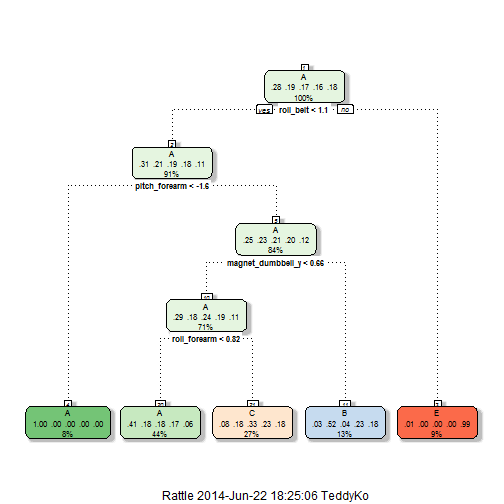

Practical Machine Learning Course Project 
========================================================

The goal of this project is to predict the manner in which they did the exercise. We will predict the exercise classes of 20 different test cases using the models we construct in this project and estimate their accuacies.

Load required libraries


```r
library(AppliedPredictiveModeling)
library(caret)
```

```
## Loading required package: lattice
## Loading required package: ggplot2
```

```r
library(rattle)
```

```
## Rattle: A free graphical interface for data mining with R.
## Version 3.0.2 r169 Copyright (c) 2006-2013 Togaware Pty Ltd.
## Type 'rattle()' to shake, rattle, and roll your data.
```

```r
library(rpart.plot)
```

```
## Loading required package: rpart
```

```r
library(randomForest)
```

```
## randomForest 4.6-7
## Type rfNews() to see new features/changes/bug fixes.
```

Import the data sets and treat empty values as NA.


```r
rm(list=ls())
trainingCSV <- read.csv("C:/Users/TeddyKo/R_working/pml-training.csv", na.strings=c("NA",""), header=TRUE)
colnames_train <- colnames(trainingCSV)
testingCSV <- read.csv("C:/Users/TeddyKo/R_working/pml-testing.csv", na.strings=c("NA",""), header=TRUE)
colnames_test <- colnames(testingCSV)

## Verify that the column names are identical in the training and test set.
## Note: excluding classe in training set and problem_id in testing set
# all.equal(colnames_train[1:length(colnames_train)-1], colnames_test[1:length(colnames_train)-1])
```

Drop NA columns and other unnecessary columns.


```r
## Drop NA columns and other unnecessary columns.
nonNAs <- function(x) {
  as.vector(apply(x, 2, function(x) length(which(!is.na(x)))))
}
## Find missing data (NA) columns to drop.
colcnts <- nonNAs(trainingCSV)
drops <- c()
for (cnt in 1:length(colcnts)) {
    if (colcnts[cnt] < nrow(trainingCSV)) {
        drops <- c(drops, colnames_train[cnt])
    }
}

## Drop NA columns and the first 7 columns
trainingCSV <- trainingCSV[,!(names(trainingCSV) %in% drops)]
trainingCSV <- trainingCSV[,8:length(colnames(trainingCSV))]
testingCSV <- testingCSV[,!(names(testingCSV) %in% drops)]
testingCSV <- testingCSV[,8:length(colnames(testingCSV))]

## Show remaining columns.
# colnames(trainingCSV)
# colnames(testingCSV)

## Check the remained columns to see which have virtually no variability.
# nzv <- nearZeroVar(trainingCSV, saveMetrics=TRUE)
# nzv
```

Prepare training, validation and testing data sets


```r
set.seed(1234)
inTrain <- createDataPartition(trainingCSV$classe, p=0.60,list=FALSE)
training <- trainingCSV[inTrain, ]
validation <- trainingCSV[-inTrain, ]
# summary(training)
# head(training)
dim(training)
```

```
## [1] 11776    53
```

```r
dim(validation)
```

```
## [1] 7846   53
```

Classification Tree:
--------------------


```r
set.seed(1234)
## Train on training set with both preprocessing and cross validation.
# model <- train(training$classe ~ ., data=training, method="rpart")
model <- train(training$classe ~ .,  preProcess=c("center", "scale"), trControl=trainControl(method = "cv", number = 4), data = training, method="rpart")
print(model, digits=3)
```

```
## CART 
## 
## 11776 samples
##    52 predictors
##     5 classes: 'A', 'B', 'C', 'D', 'E' 
## 
## Pre-processing: centered, scaled 
## Resampling: Cross-Validated (4 fold) 
## 
## Summary of sample sizes: 8832, 8833, 8832, 8831 
## 
## Resampling results across tuning parameters:
## 
##   cp      Accuracy  Kappa   Accuracy SD  Kappa SD
##   0.0362  0.51      0.361   0.00793      0.0107  
##   0.0611  0.431     0.233   0.0713       0.12    
##   0.117   0.346     0.0939  0.0411       0.0626  
## 
## Accuracy was used to select the optimal model using  the largest value.
## The final value used for the model was cp = 0.0362.
```

```r
print(model$finalModel, digits=3)
```

```
## n= 11776 
## 
## node), split, n, loss, yval, (yprob)
##       * denotes terminal node
## 
##  1) root 11776 8430 A (0.28 0.19 0.17 0.16 0.18)  
##    2) roll_belt< 1.05 10774 7440 A (0.31 0.21 0.19 0.18 0.11)  
##      4) pitch_forearm< -1.62 919    2 A (1 0.0022 0 0 0) *
##      5) pitch_forearm>=-1.62 9855 7430 A (0.25 0.23 0.21 0.2 0.12)  
##       10) magnet_dumbbell_y< 0.656 8314 5940 A (0.29 0.18 0.24 0.19 0.11)  
##         20) roll_forearm< 0.817 5137 3020 A (0.41 0.18 0.18 0.17 0.061) *
##         21) roll_forearm>=0.817 3177 2120 C (0.08 0.18 0.33 0.23 0.18) *
##       11) magnet_dumbbell_y>=0.656 1541  743 B (0.033 0.52 0.039 0.23 0.18) *
##    3) roll_belt>=1.05 1002   10 E (0.01 0 0 0 0.99) *
```

```r
fancyRpartPlot(model$finalModel)
```

```
## Loading required package: RColorBrewer
```

 

```r
## Run against validation set.
predictions <- predict(model, newdata=validation)
print(confusionMatrix(predictions, validation$classe), digits=4)
```

```
## Confusion Matrix and Statistics
## 
##           Reference
## Prediction    A    B    C    D    E
##          A 2029  638  644  567  209
##          B   44  505   49  232  211
##          C  155  375  675  487  383
##          D    0    0    0    0    0
##          E    4    0    0    0  639
## 
## Overall Statistics
##                                           
##                Accuracy : 0.4904          
##                  95% CI : (0.4793, 0.5016)
##     No Information Rate : 0.2845          
##     P-Value [Acc > NIR] : < 2.2e-16       
##                                           
##                   Kappa : 0.3339          
##  Mcnemar's Test P-Value : NA              
## 
## Statistics by Class:
## 
##                      Class: A Class: B Class: C Class: D Class: E
## Sensitivity            0.9091  0.33267  0.49342   0.0000  0.44313
## Specificity            0.6334  0.91530  0.78388   1.0000  0.99938
## Pos Pred Value         0.4965  0.48511  0.32530      NaN  0.99378
## Neg Pred Value         0.9460  0.85114  0.87992   0.8361  0.88852
## Prevalence             0.2845  0.19347  0.17436   0.1639  0.18379
## Detection Rate         0.2586  0.06436  0.08603   0.0000  0.08144
## Detection Prevalence   0.5209  0.13268  0.26447   0.0000  0.08195
## Balanced Accuracy      0.7712  0.62399  0.63865   0.5000  0.72125
```

```r
## Run against testing set.
print(predict(model, newdata=testingCSV))
```

```
##  [1] C A C A A C C A A A C C C A C A A A A C
## Levels: A B C D E
```

```r
# > print(predict(model, newdata=testingCSV))
#  [1] C A C A A C C A A A C C C A C A A A A C
# Levels: A B C D E
# >
```

Random Forest:
--------------


```r
set.seed(1234)
## Train on training set with both preprocessing and cross validation.
# model <- train(training$classe ~ ., data=training, method="rf")
model <- train(training$classe ~ .,  preProcess=c("center", "scale"), trControl=trainControl(method = "cv", number = 4), data = training, method="rf")
print(model, digits=3)
```

```
## Random Forest 
## 
## 11776 samples
##    52 predictors
##     5 classes: 'A', 'B', 'C', 'D', 'E' 
## 
## Pre-processing: centered, scaled 
## Resampling: Cross-Validated (4 fold) 
## 
## Summary of sample sizes: 8832, 8833, 8832, 8831 
## 
## Resampling results across tuning parameters:
## 
##   mtry  Accuracy  Kappa  Accuracy SD  Kappa SD
##   2     0.988     0.985  0.00169      0.00214 
##   27    0.989     0.986  0.000896     0.00113 
##   52    0.981     0.976  0.00504      0.00637 
## 
## Accuracy was used to select the optimal model using  the largest value.
## The final value used for the model was mtry = 27.
```

```r
## Run against validation set.
predictions <- predict(model, newdata=validation)
print(confusionMatrix(predictions, validation$classe), digits=4)
```

```
## Confusion Matrix and Statistics
## 
##           Reference
## Prediction    A    B    C    D    E
##          A 2231   18    0    0    0
##          B    0 1494   14    1    3
##          C    1    6 1346   21    2
##          D    0    0    8 1262    4
##          E    0    0    0    2 1433
## 
## Overall Statistics
##                                           
##                Accuracy : 0.9898          
##                  95% CI : (0.9873, 0.9919)
##     No Information Rate : 0.2845          
##     P-Value [Acc > NIR] : < 2.2e-16       
##                                           
##                   Kappa : 0.9871          
##  Mcnemar's Test P-Value : NA              
## 
## Statistics by Class:
## 
##                      Class: A Class: B Class: C Class: D Class: E
## Sensitivity            0.9996   0.9842   0.9839   0.9813   0.9938
## Specificity            0.9968   0.9972   0.9954   0.9982   0.9997
## Pos Pred Value         0.9920   0.9881   0.9782   0.9906   0.9986
## Neg Pred Value         0.9998   0.9962   0.9966   0.9963   0.9986
## Prevalence             0.2845   0.1935   0.1744   0.1639   0.1838
## Detection Rate         0.2843   0.1904   0.1716   0.1608   0.1826
## Detection Prevalence   0.2866   0.1927   0.1754   0.1624   0.1829
## Balanced Accuracy      0.9982   0.9907   0.9896   0.9898   0.9967
```

```r
## Run against testing set.
print(predict(model, newdata=testingCSV))
```

```
##  [1] B A B A A E D B A A B C B A E E A B B B
## Levels: A B C D E
```

```r
# > print(predict(model, newdata=testingCSV))
#  [1] B A B A A E D B A A B C B A E E A B B B
# Levels: A B C D E
# >
```

Out of Sample Error: the error rates we get on new data sets
------------------------------------------------------------


```r
# Classification Tree: on validation data set = 1 - 0.4904
# Random Forest:       on validation data set = 1 - 0.9898
#
## The accuracy of Random Forest model looks fine; 
## but the accuracy of Classification Tree still needs some work.
```

